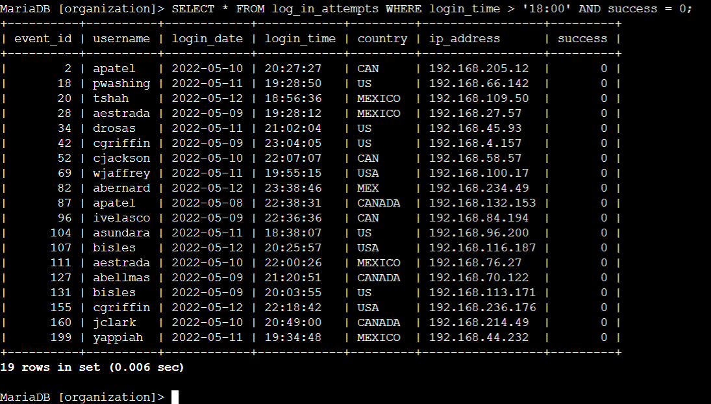
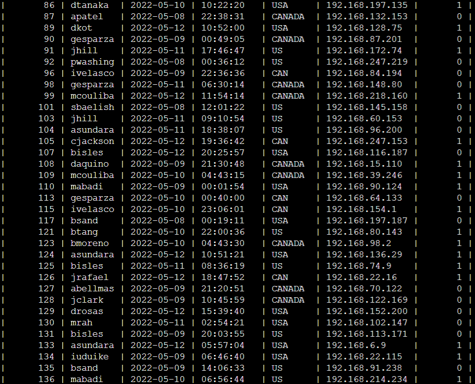
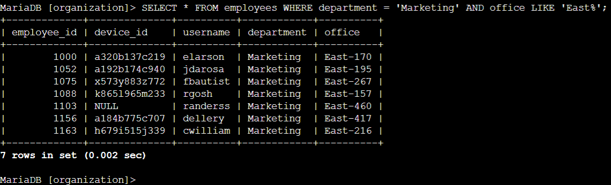

# Apply filters to SQL queries

## Project description

In this scenario, you need to obtain specific information about employees, their machines, and the departments they belong to from the database.

Your team needs data to investigate potential security issues and to update computers.

You are responsible for filtering the required information from the database.

Here’s how you’ll do this task: First, you’ll retrieve all failed login attempts after business hours. Second, you’ll retrieve all login attempts that occurred on specific dates. Third, you’ll retrieve logins that didn't originate in Mexico. Fourth, you’ll retrieve information about certain employees in the Marketing department. Fifth, you’ll retrieve information about employees in the Finance or the Sales department. Finally, you’ll obtain information about employees who are not in the Information Technology department.

## Retrieve after hours failed login attempts

Your team is investigating failed login attempts that were made after business hours. You want to retrieve this information from the login activity. You’ll identify all unsuccessful attempts after 18:00.  

## Retrieve login attempts on specific dates

Your team is investigating a suspicious event that occurred on `'2022-05-09'`. You want to retrieve all login attempts that occurred on this day and the day before (`'2022-05-08'`).  

## Retrieve login attempts outside of Mexico

Now, your team is investigating logins that did not originate in Mexico, and you need to find this information. Note that the country field includes entries with `'MEX'` and `'MEXICO'`. You should use the `NOT` and `LIKE` operators and the matching pattern `'MEX%'`.  
  

## Retrieve employees in Marketing

For tasks 4, 5 and 6 you need to retrieve the information from the `department` and `office` columns in the `employees` table.  
Your team is updating employee machines, and you need to obtain the information about employees in the `'Marketing'` department who are located in all offices in the East building (such as `'East-170'` or `'East-320'`).  

## Retrieve employees in Finance or Sales

Now, your team needs to perform a different update to the computers of all employees in the Finance or the Sales department, and you need to locate information on these employees.  

## Retrieve all employees not in IT

Your team needs to make one more update. This update was already made to employee computers in the Information Technology department. The team needs information about employees who are not in that department. You should use the `NOT` operator to identify these employees.  

## Summary

This exercise provided practical experience in using SQL to:

* run SQL queries to retrieve information from a database and  
* apply AND, OR, and NOT operators to filter SQL queries.

---

[Back](README.md)