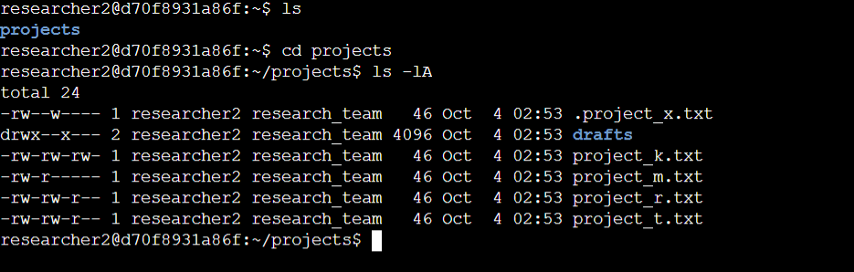
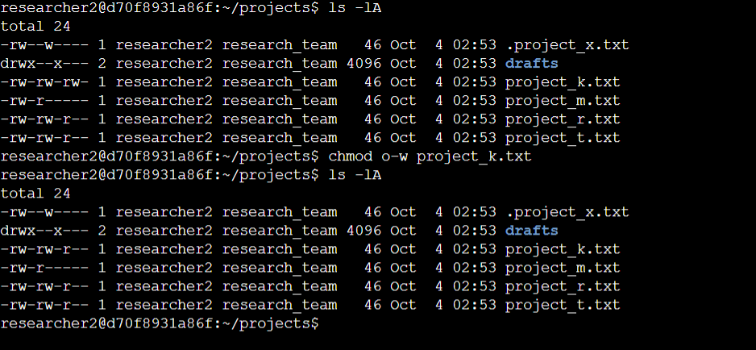
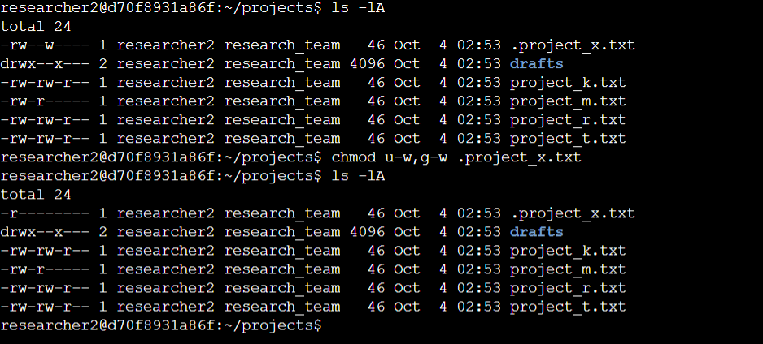
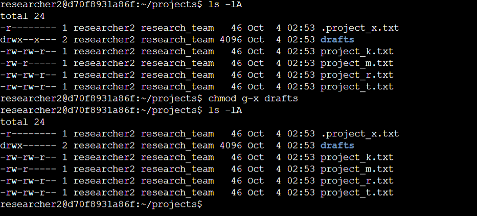

# File permissions in Linux

## Project description

In this scenario, I examined and managed the permissions on the files in the `/home/researcher2/projects` directory for the `researcher2` user.

The `researcher2` user is part of the `research_team` group.

I checked the permissions for all files in the directory, including any hidden files, to make sure that permissions aligned with the authorization that should be given. When it didn’t, I changed the permissions.

Here’s how I was instructed to do this task: First, check the user and group permissions for all files in the projects directory. Next, check whether any files have incorrect permissions and change the permissions as needed. Finally, check the permissions of the `/home/researcher2/projects/drafts` directory and modify these permissions to remove any unauthorized access.

The specified permissions are as follows:

1. None of the files should allow the “other” user type to write to files.   
2. The file `project_m.txt` is a restricted file and should not be readable or writable by the group or “other;” only the user should have these permissions on this file.  
3. The file `.project_x.txt` is a hidden file that has been archived and should not be written to by anyone. (The user and group should still be able to read this file.)  
4. Only the `researcher2` user should be allowed to access the `drafts` directory and its contents. (This means that only `researcher2` should have execute privileges.)

## Check file and directory details



I chose to use the `ls -lA` command to list the contents of the directory because the `-l` flag uses the long listing format (shows the permissions string) and the `-A` flag displays almost all files, showing those preceded by a period (`.`) but ignores the implied `.` and `..` directories.

## Describe the permissions string

a 10-character string begins each entry and indicates how the permissions on the file are set. For instance, a directory with full permissions for all owner types would be `drwxrwxrwx`:

* The 1st character indicates the file type. The `d` indicates it’s a directory. When this character is a hyphen (`-`), it's a regular file.  
* The 2nd-4th characters indicate the read (`r`), write (`w`), and execute (`x`) permissions for the user. When one of these characters is a hyphen (`-`) instead, it indicates that this permission is not granted to the user.  
* The 5th-7th character indicates the read (`r`), write (`w`), and execute (`x`) permissions for the group. When one of these characters is a hyphen (`-`) instead, it indicates that this permission is not granted for the group.  
* The 8th-10th characters indicate the read (`r`), write (`w`), and execute (`x`) permissions for the owner type of “other.” This owner type consists of all other users on the system apart from the user and the group. When one of these characters is a hyphen (`-`) instead, that indicates that this permission is not granted for “other.”

The second block of text in the expanded directory listing is the user who owns the file. The third block of text is the group owner of the file.

## Change file permissions



## Change file permissions on a hidden file



## Change directory permissions



## Summary

In order to complete all steps at once, after reviewing the existing file structure using the command `ls -lA`, the following code block can be executed:

```bash
chmod o-w project_k.txt
chmod u-w,g-w .project_x.txt
chmod g-x drafts
```

---

[Back](README.md)
